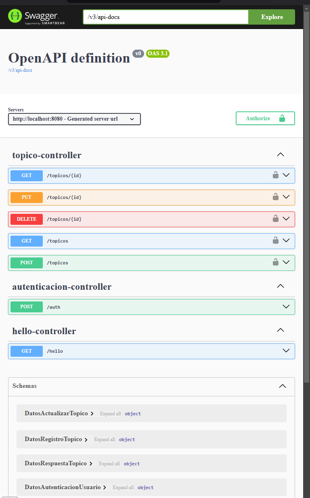
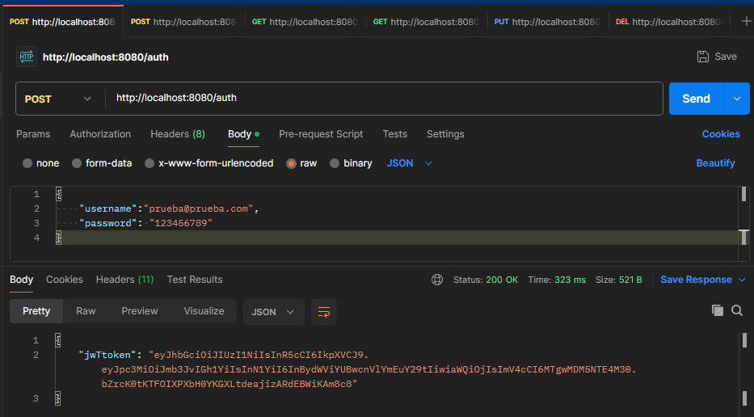
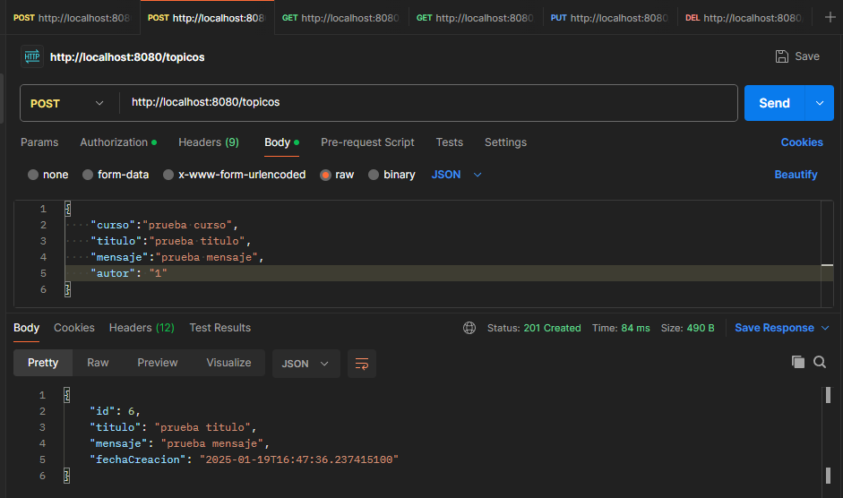
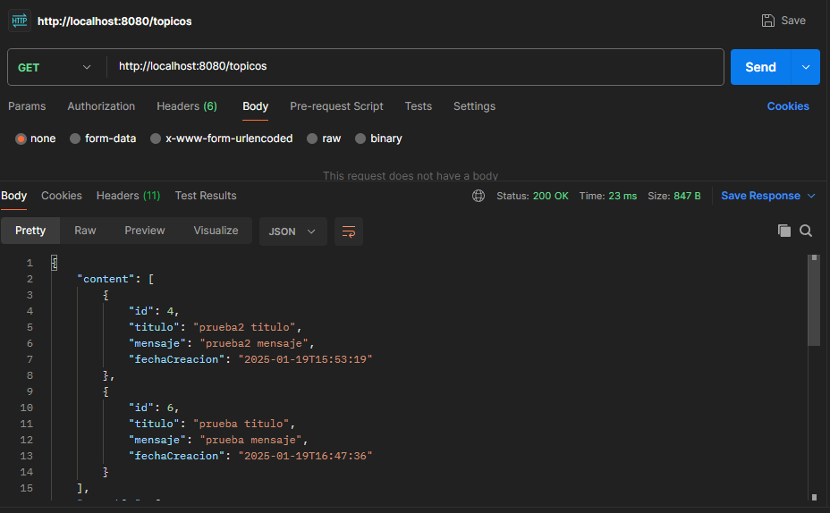
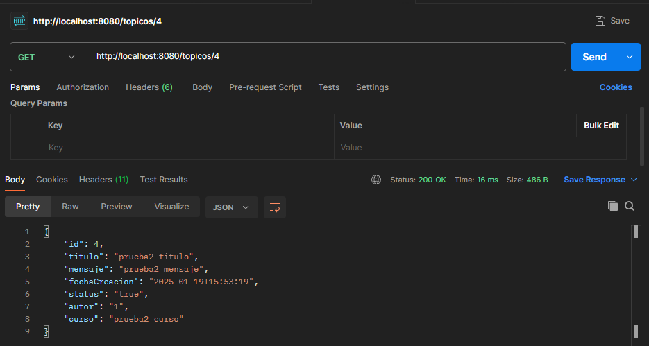
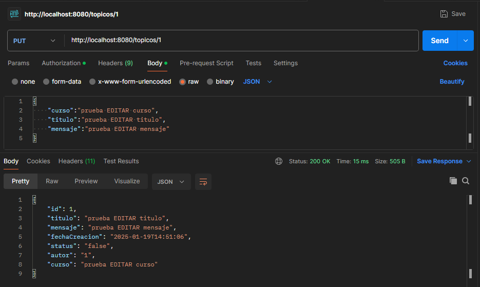
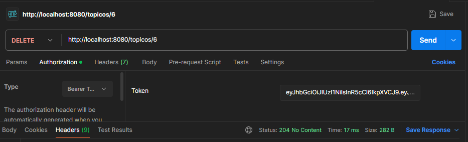

# Foro Hub

Este proyecto es un software en Java utilizando Spring Boot y JWT para realizar una API que sigue los principios de diseño de la arquitectura REST, adicionando servicios de autenticación/autorización. La API acepta las querys de tipo POST, GET, PUT y DELETE para el manejo de datos y persistencia de los mismos en una base de datos relacional SQL, especificamente MySQL. Los metodos POST, PUT y DELETE requieren un proceso de autenticacion por medio de JSON Web Tokens. El software puede ser verificado por un Cliente real, o por software como Postman o Insomnia.

## Características
- API que sigue los principios de diseño de la arquitectura REST.
- Almacenamiento de datos en base de datos relacional SQL.
- Servicio de autenticación/autorización para restringir el acceso a la información.
- Crear un nuevo tópico.
- Mostrar todos los tópicos creados.
- Mostrar un tópico específico.
- Actualizar un tópico.
- Eliminar un tópico.
- Documentacion utilizando Springdoc Openapi y Swagger

## Tecnologías Utilizadas

- Java
- Spring Boot 3
- MySQL
- Java Persistence API
- API REST
- JWT con Auth0
- Springdoc Openapi

## Instalación

1. Clona el repositorio:

```
   git clone https://github.com/sebascasta14/challenge-foro-hub.git
```

2. Navega al directorio del proyecto:

```
   cd challenge-foro-hub
```

3. Abre el proyecto en el IDE de preferencia.
4. Ejecuta el programa.
5. Realiza querys a la API con un cliente, Postman, entre otros.

## USO

1. Crea una base de datos en MySQL.
2. Registra los datos relacionados a la base de datos como variables de entorno.
3. Realiza el registro de usuarios de forma manual en la tabla correspondiente.
4. Realiza el proceso de autenticación para querys tipo POST, PUT, DELETE
5. Ingresa los datos que se soliciten dependiendo de la query seleccionada.

## Capturas de Pantalla















## Licencia

Este proyecto está bajo la Licencia MIT.

## Contacto

Para consultas o sugerencias, puedes contactarme en:

GitHub: [sebascasta14](https://github.com/sebascasta14)
LinkedIn: [Sebastian Castaneda](https://www.linkedin.com/in/sebastian-castaneda-27564b236/)